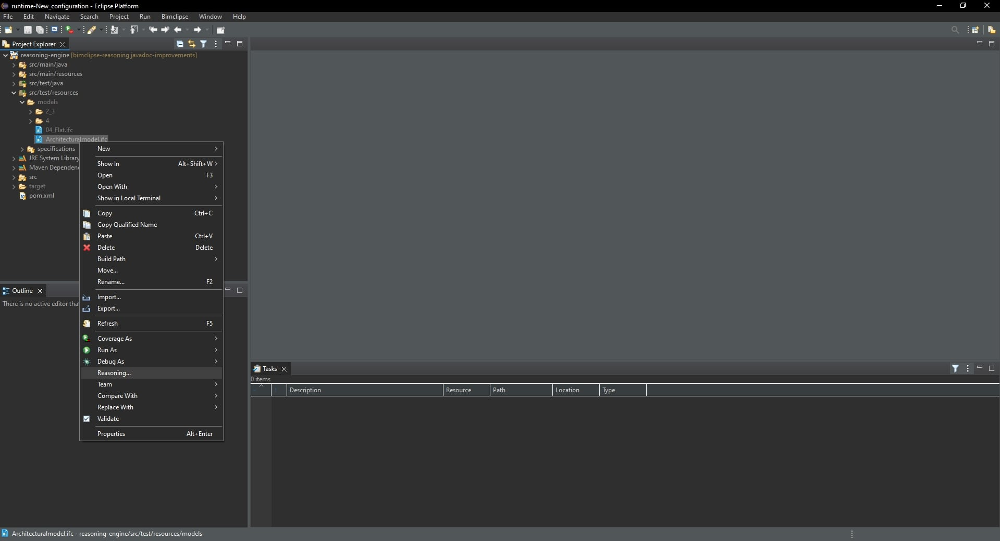
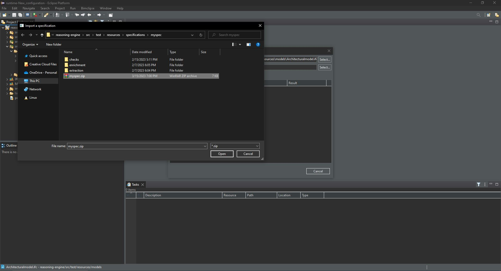
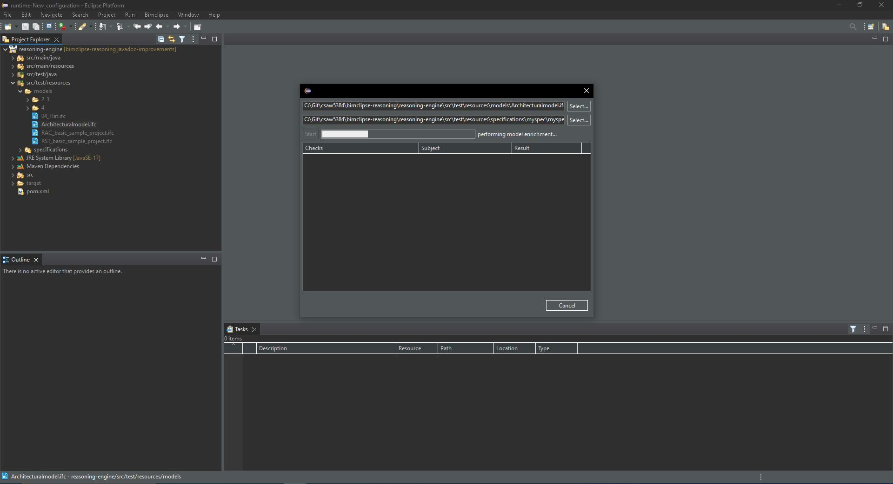
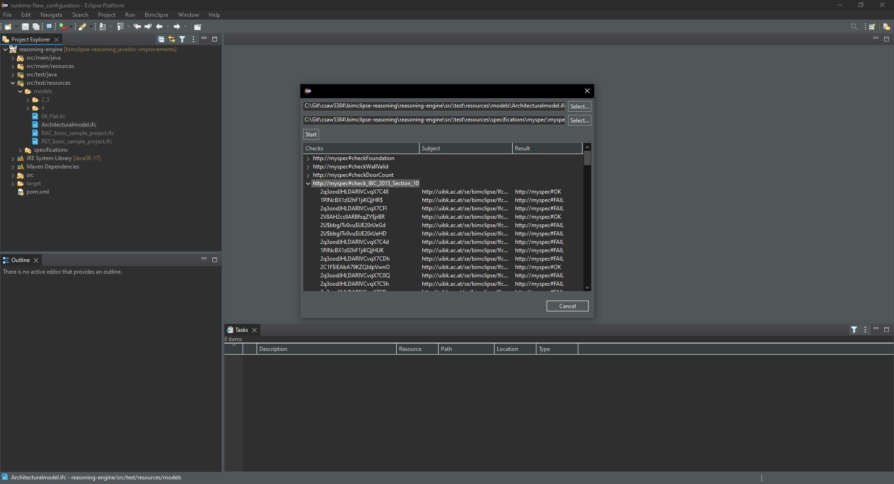

# BIMClipse Reasoning Plugin

Reasoning engine integration for BIMClipse.

### Building the plugin

The plugin is built using following command:

```text
mvn clean install
```

### Installing the plugin

After building, the plugin (`.jar`) is located in `reasoning-plugin/target/`. In order to use the plugin in the Eclipse
IDE, copy the `.jar` file of the plugin to `<eclipse-install-location>/dropins/`. If the Eclipse IDE is already running,
you will have to reopen it.

### Executing the plugin

1. Right-click a building model (.ifc) from the project explorer and select "Reasoning...":

    

2. Import a specification:

    

3. Start the reasoning procedure:

    

4. View the results:

    

Note: Checking large building models (> 10MB), might cause out-of-memory errors. In
that case, it is necessary to increase the amount of heap space available to the
Eclipse IDE. This is configured through the `-Xmx` option in the
`<eclipse-install-location>/eclipse.ini` file.